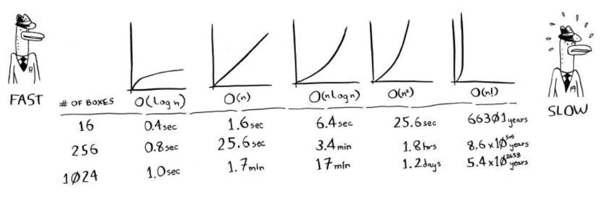

# Intro to algorithms

## Logarithms
log10 100 is like asking, “How many 10s do we multiply together to get 100?” he answer is 2: 10 × 10. So log10 100 = 2. Logs are the lip of exponentials.

### Logs are the flip of exponentials.
In this book, when I talk about running time in Big O notation (explained a little later), log always means log2. When you search for an element using simple search, in the worst case you might have to look at every single element. So for a list of 8 numbers, you’d have to check 8 numbers at most. For binary search, you have to check log n elements in the worst case. For a list of 8 elements, log 8 == 3, because 23 == 8. So for a list of 8 numbers, you would have to check 3 numbers at most. For a list of 1,024 elements, log 1,024 = 10, because 210 == 1,024. So for a list of 1,024 numbers, you’d have to check 10 numbers at most.

## Some common Big O run times
Here are ive Big O run times that you’ll encounter a lot, sorted from fastest to slowest:
- **O(log n)**, also known as log time. Example: Binary search.
- **O(n)**, also known as linear time. Example: Simple search.
- **O(n * log n)**. Example: A fast sorting algorithm, like quicksort (coming up in chapter 4).
- **O(n2)**. Example: A slow sorting algorithm, like selection sort (coming up in chapter 2).
- **O(n!)**. Example: A really slow algorithm, like the traveling salesperson (coming up next!).

Here’s how long it would take to draw a grid for the rest of the algorithms, from fastest to slowest:

## Recap
- Binary search is a lot faster than simple search.
- O(log n) is faster than O(n), but it gets a lot faster once the list of items you’re searching through grows.
- Algorithm speed isn’t measured in seconds.
- Algorithm times are measured in terms of growth of an algorithm.
- Algorithm times are written in Big O notation.