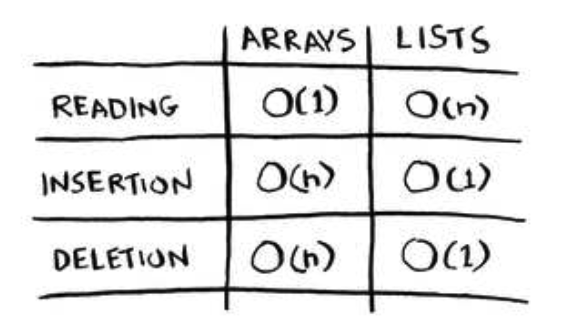
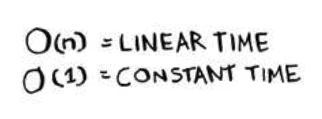

# ch2. selection sort

### Checking fewer elements each time
Maybe you’re wondering: as you go through the operations, the number of elements you have to check keeps decreasing. Eventually, you’re down to having to check just one element. So how can the run time still be O(n2)? hat’s a good question, and the answer has to do with constants in Big O notation. I’ll get into this more in chapter 4, but here’s the gist.
You’re right that you don’t have to check a list of n elements each time. You check n elements, then n – 1, n - 2 ... 2, 1. On average, you check a list that has 1/2 × n elements. he runtime is O(n × 1/2 × n). But constants like 1/2 are ignored in Big O notation (again, see chapter 4 for the full discussion), so you just write O(n × n) or O(n2).

Here are the run times for common operations on arrays and linked lists:

## Recap:
- Your computer’s memory is like a giant set of drawers.
- When you want to store multiple elements, use an array or a list.
- With an array, all your elements are stored right next to each other.
- With a list, elements are strewn all over, and one element stores the address of the next one.
- Arrays allow fast reads.
- Linked lists allow fast inserts and deletes.
- All elements in the array should be the same type (all ints, all doubles, and so on).