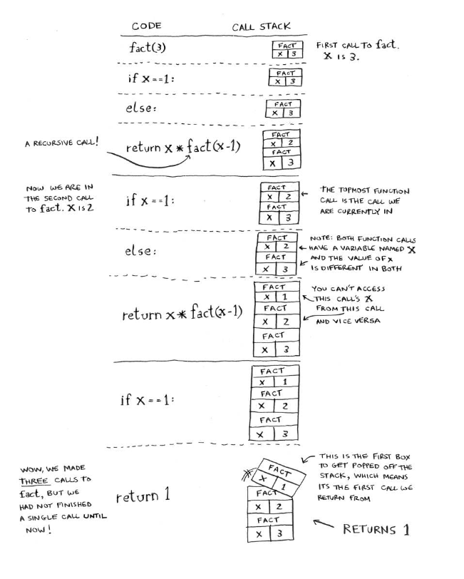
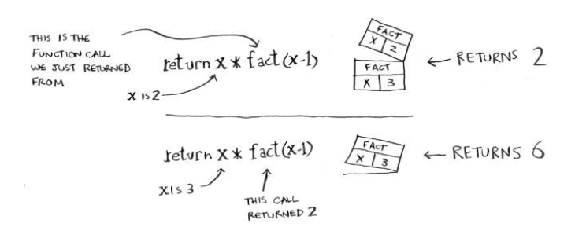

# Recursion

Pseudocode:

Code with loop:
```py
def look_for_key(main_box):
    pile = main_box.make_a_pile_to_look_through
    while pile is not empty:
        box = pile.grab_a_box()
        for item in box:
            if item.is_a_box:
                pile.append(item)
            elif item.is_a_key():
                print "found the key!"
```

Code with recursion:
```py
def look_for_key(main_box):
    for item in box:
        if item.is_a_box:
            look_for_key(item)
        elif item.is_a_key():
            print "found the key!"
```

Recursion illustration on factorial function




## Recap:
- Recursion is when a function calls itself.
- Every recursive function has two cases: the base case and the recursive case.
- A stack has two operations: push and pop.
- All function calls go onto the call stack.
- he call stack can get very large, which takes up a lot of memory.