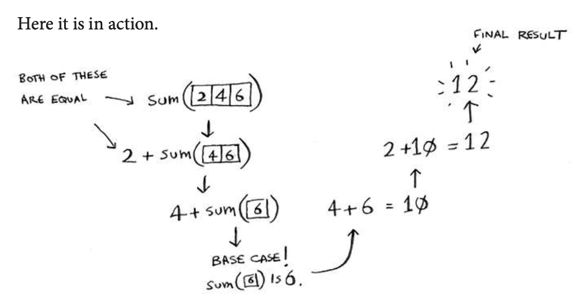
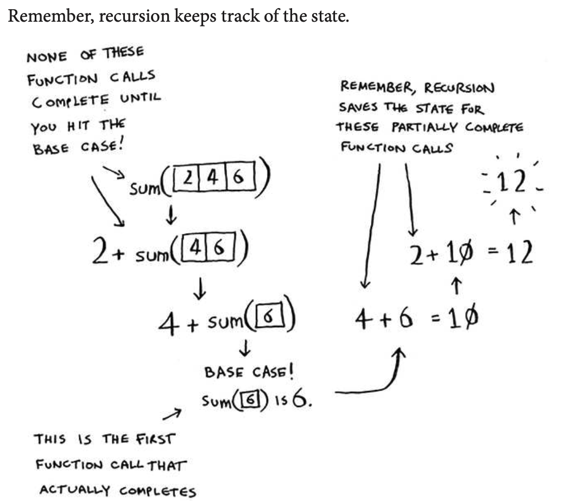

## Euclid’s algorithm
“If you ind the biggest box that will work for this size, that will be the biggest box that will work for the entire farm.” If it’s not obvious to you why this statement is true, don’t worry. It isn’t obvious. Unfortunately, the proof for why it works is a little too long to include in this book, so you’ll just have to believe me that it works. If you want to understand the proof, look up Euclid’s algorithm. he Khan academy has a good explanation here: https://www.khanacademy.org/computing/computer-science/ cryptography/modarithmetic/a/the-euclidean-algorithm.

Example of recursion work on sum function:





### Tip
When you’re writing a recursive function involving an array, the base case is often an empty array or an array with one element. If you’re stuck, try that irst.


## Sneak peak at functional programming
“Why would I do this recursively if I can do it easily with a loop?” you may be thinking. Well, this is a sneak peek into functional programming! Functional programming languages like Haskell don’t have loops, so you have to use recursion to write functions like this. If you have a good understanding of recursion, functional languages will be easier to learn. For example, here’s how you’d write a sum function in Haskell:
```h
sum [] = 0                  <=== Base case
sum (x:xs) = x + (sum xs)   <=== Recursive case
```
Notice that it looks like you have two deinitions for the function. he irst deinition is run when you hit the base case. he second deinition runs at the recursive case. You can also write this function in Haskell using an if statement:

```h
sum arr = if arr == [] 
    then 0
    else (head arr) + (sum (tail arr))
```
But the irst deinition is easier to read. Because Haskell makes heavy use of recursion, it includes all kinds of niceties like this to make recursion easy. If you like recursion, or you’re interested in learning a new language, check out Haskell.