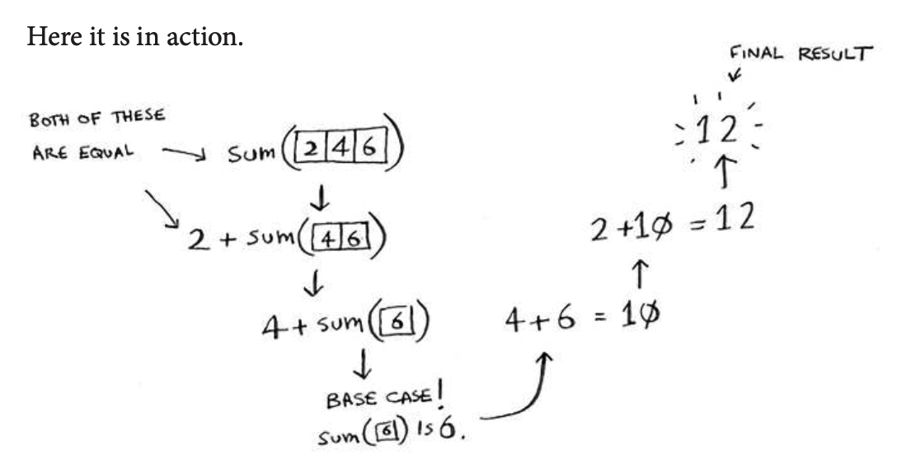
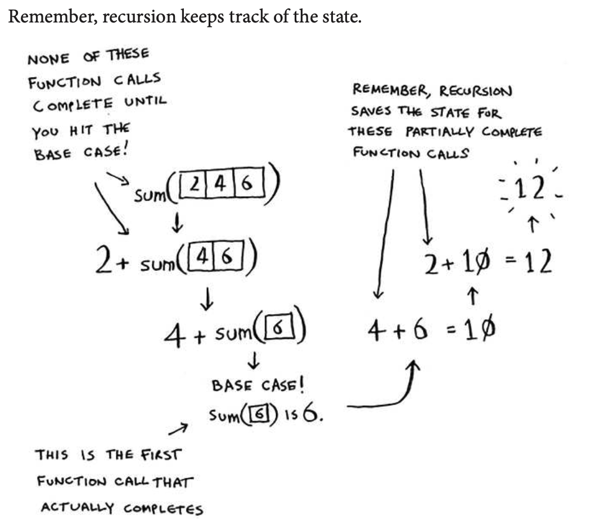
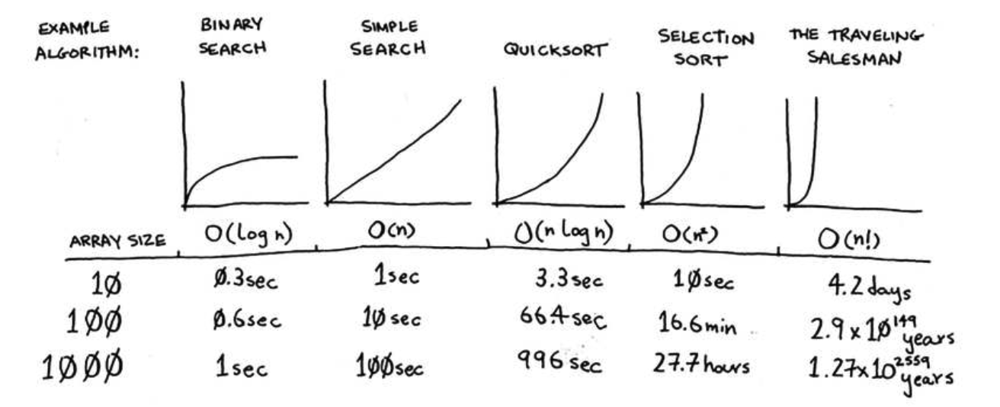
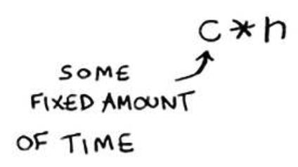

# Quicksort

## Euclid’s algorithm
“If you ind the biggest box that will work for this size, that will be the biggest box that will work for the entire farm.” If it’s not obvious to you why this statement is true, don’t worry. It isn’t obvious. Unfortunately, the proof for why it works is a little too long to include in this book, so you’ll just have to believe me that it works. If you want to understand the proof, look up Euclid’s algorithm. he Khan academy has a good explanation here: https://www.khanacademy.org/computing/computer-science/ cryptography/modarithmetic/a/the-euclidean-algorithm.

Example of recursion work on sum function:





### Tip
When you’re writing a recursive function involving an array, the base case is often an empty array or an array with one element. If you’re stuck, try that irst.


## Sneak peak at functional programming
“Why would I do this recursively if I can do it easily with a loop?” you may be thinking. Well, this is a sneak peek into functional programming! Functional programming languages like Haskell don’t have loops, so you have to use recursion to write functions like this. If you have a good understanding of recursion, functional languages will be easier to learn. For example, here’s how you’d write a sum function in Haskell:
```h
sum [] = 0                  <=== Base case
sum (x:xs) = x + (sum xs)   <=== Recursive case
```
Notice that it looks like you have two deinitions for the function. he irst deinition is run when you hit the base case. he second deinition runs at the recursive case. You can also write this function in Haskell using an if statement:

```h
sum arr = if arr == [] 
    then 0
    else (head arr) + (sum (tail arr))
```
But the irst deinition is easier to read. Because Haskell makes heavy use of recursion, it includes all kinds of niceties like this to make recursion easy. If you like recursion, or you’re interested in learning a new language, check out Haskell.


### Inductive proofs
You just got a sneak peak into inductive proofs! Inductive proofs are one way to prove that your algorithm works. Each inductive proof has two steps: the base case and the inductive case. Sound familiar? For example, suppose I want to prove that I can climb to the top of a ladder. In the inductive case, if my legs are on a rung, I can put my legs on the next rung. So if I’m on rung 2, I can climb to rung 3. hat’s the inductive case. For the base case, I’ll say that my legs are on rung 1. herefore, I can climb the entire ladder, going up one rung at a time.
You use similar reasoning for quicksort. In the base case, I showed that the algorithm works for the base case: arrays of size 0 and 1. In the inductive case, I showed that if quicksort works for an array of size 1, it will work for an array of size 2. And if it works for arrays of size 2, it will work for arrays of size 3, and so on. hen I can say that quicksort will work for all arrays of any size. I won’t go deeper into inductive proofs here, but they’re fun and go hand-in-hand with D&C.


### Big O notation revisited




When you write Big O notation like O(n), it really means this.

]

c is some ixed amount of time that your algorithm takes. It’s called the constant. 

## Recap:
- D&C works by breaking a problem down into smaller and smaller pieces. If you’re using D&C on a list, the base case is probably an empty array or an array with one element.
- If you’re implementing quicksort, choose a random element as the pivot. he average runtime of quicksort is O(n log n)!
- he constant in Big O notation can matter sometimes. hat’s why quicksort is faster than merge sort.
- he constant almost never matters for simple search versus binary search, because O(log n) is so much faster than O(n) when your list gets big.