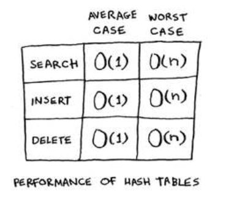
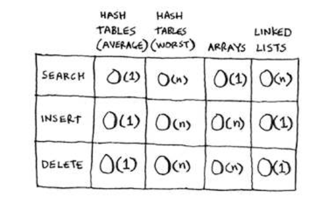

# Hashtables

In technical terminology, we’d say that a hash function “maps strings to numbers.” You might think there’s no discernable pattern to what number you get out when you put a string in. But there are some requirements for a hash function:
- It needs to be consistent. For example, suppose you put in “apple” and get back “4”. Every time you put in “apple”, you should get “4” back. Without this, your hash table won’t work.
- It should map diferent words to diferent numbers. For example, a hash function is no good if it always returns “1” for any word you put in. In the best case, every diferent word should map to a diferent number.

Whay hash function works:
- The hash function consistently maps a name to the same index. Every time you put in “avocado”, you’ll get the same number back. So you can use it the irst time to ind where to store the price of an avocado, and then you can use it to ind where you stored that price.
- The hash function maps diferent strings to diferent indexes. “Avocado” maps to index 4. “Milk” maps to index 0. Everything maps to a diferent slot in the array where you can store its price.
- The hash function knows how big your array is and only returns valid indexes. So if your array is 5 items, the hash function doesn’t return 100 ... that wouldn’t be a valid index in the array.

Hashes are good for:
- Modeling relationships from one thing to another thing
- Filtering out duplicates
- Caching/memorizing data instead of making your server do work

Look at the average case for hash tables. Hash tables are as fast as arrays at searching (getting a value at an index). And they’re as fast as linked lists at inserts and deletes. It’s the best of both worlds! But in the worst case, hash tables are slow at all of those. So it’s important that you don’t hit worst-case performance with hash tables. And to do that, you need to avoid collisions. To avoid collisions, you need
- A low load factor
- A good hash function

More about creating hash function read in book...

## Recap
You’ll almost never have to implement a hash table yourself. he programming language you use should provide an implementation for you. You can use Python’s hash tables and assume that you’ll get the average case performance: constant time.
Hash tables are a powerful data structure because they’re so fast and they let you model data in a diferent way. You might soon ind that you’re using them all the time:
- You can make a hash table by combining a hash function
with an array.
- Collisions are bad. You need a hash function that minimizes collisions.
- Hash tables have really fast search, insert, and delete.
- Hash tables are good for modeling relationships from one item to another item.
- Once your load factor is greater than .07, it’s time to resize your hash table.
- Hash tables are used for caching data (for example, with a web server).
- Hash tables are great for catching duplicates.