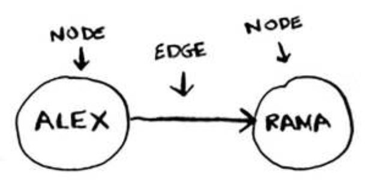
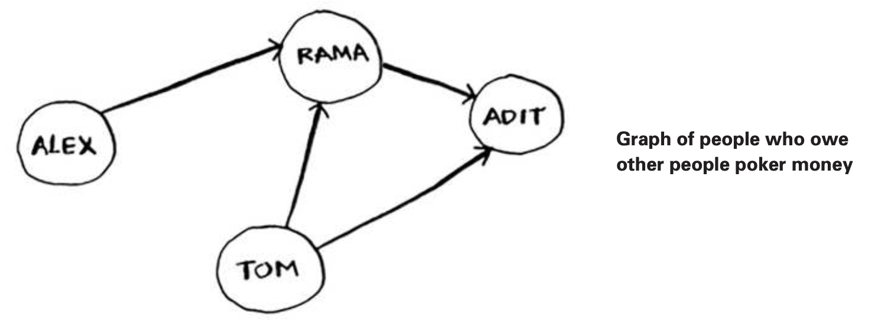
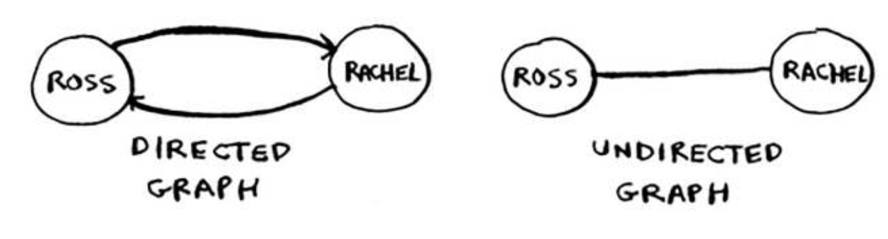

### Graph
A graph models a set of connections



The full graph could look something like this.



That’s all there is to it! Graphs are made up of nodes and edges. A node can be directly connected to many other nodes. hose nodes are called its neighbors. In this graph, Rama is Alex’s neighbor. Adit isn’t Alex’s neighbor, because they aren’t directly connected. But Adit is Rama’s and Tom’s neighbor.

Graphs are a way to model how diferent things are connected to one another. 


### Breadth-irst search

Breadth-first search is search algorithm: one that runs on graphs. It can help answer two types of questions:
• Question type 1: Is there a path from node A to node B?
• Question type 2: What is the shortest path from node A to node B?

The queue is called a FIFO data structure: First In, First Out. In contrast, a stack is a LIFO data structure: Last In, First Out.


Anuj, Peggy, hom, and Jonny don’t have any neighbors. hey have arrows pointing to them, but no arrows from them to someone else. This is called a **directed** graph—the relationship is only one way. So Anuj is Bob’s neighbor, but Bob isn’t Anuj’s neighbor. An **undirected** graph doesn’t have any arrows, and both nodes are each other’s neighbors. For example, both of these graphs are equal.



### Implementing graph in code

```python
graph = {}
graph["you"] = ["alice", "bob", "claire"]
graph["alice"] = ["peggy"] 
graph["bob"] = ["anuj", "peggy"] 
graph["claire"] = ["thom", "jonny"] 
graph["anuj"] = []
graph["peggy"] = []
graph["thom"] = []
graph["jonny"] = []
```


## Running time
If you search your entire network for a mango seller, that means you’ll follow each edge (remember, an edge is the arrow or connection from one person to another). So the running time is at least O(number of edges).

You also keep a queue of every person to search. Adding one person to the queue takes constant time: O(1). Doing this for every person will take O(number of people) total. Breadth-irst search takes O(number of people + number of edges), and it’s more commonly written as O(V+E) (V for number of vertices, E for number of edges).


## Recap
- Breadth-irst search tells you if there’s a path from A to B.
- If there’s a path, breadth-irst search will ind the shortest path.
- If you have a problem like “ind the shortest X,” try modeling your problem as a graph, and use breadth-irst search to solve.
- A directed graph has arrows, and the relationship follows the direction of the arrow (rama -> adit means “rama owes adit money”).
- Undirected graphs don’t have arrows, and the relationship goes both ways (ross - rachel means “ross dated rachel and rachel dated ross”).
- Queues are FIFO (First In, First Out).
- Stacks are LIFO (Last In, First Out).
- You need to check people in the order they were added to the search list, so the search list needs to be a queue. Otherwise, you won’t get the shortest path.
- Once you check someone, make sure you don’t check them again. Otherwise, you might end up in an ininite loop.