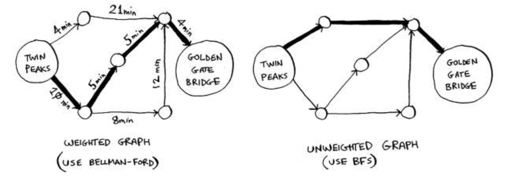
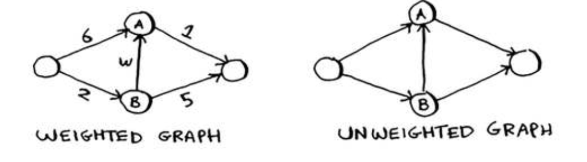
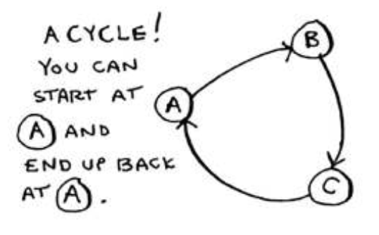
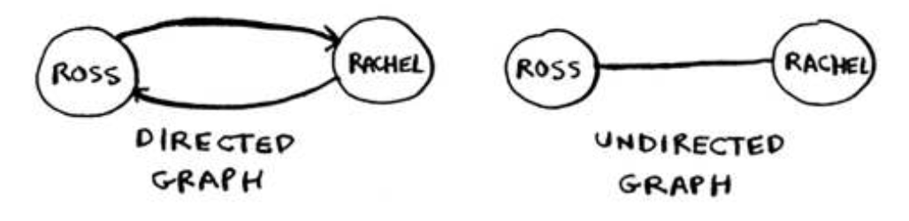
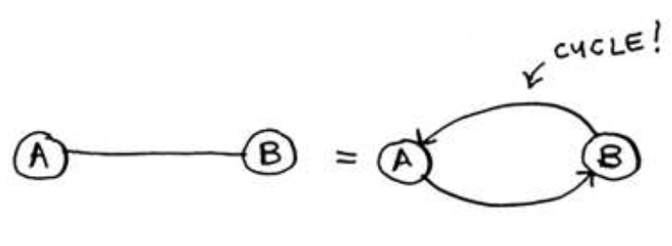

# Dijkstra’s algorithm

In the last chapter, you used breadth-irst search to ind the shortest path between two points. Back then, “shortest path” meant the path with the fewest segments. But in Dijkstra’s algorithm, you assign a number or weight to each segment. hen Dijkstra’s algorithm inds the path with the smallest total weight.

To recap, Dijkstra’s algorithm has four steps:
1. Find the cheapest node. his is the node you can get to in the least amount of time.
2. Check whether there’s a cheaper path to the neighbors of this node. If so, update their costs.
3. Repeat until you’ve done this for every node in the graph.
4. Calculate the inal path. 

To calculate the shortest path in an unweighted graph, use breadth-irst search. To calculate the shortest path in a weighted graph, use Dijkstra’s algorithm. Graphs can also have cycles. A cycle looks like this.

An undirected graph means that both nodes point to each other. hat’s a cycle!

With an undirected graph, each edge adds another cycle.** Dijkstra’s algorithm only works with directed acyclic graphs, called DAGs for short.**

**You can’t use Dijkstra’s algorithm if you have negative-weight edges.**

If you want to ind the shortest path in a graph that has negative-weight edges, there’s an algorithm for that! It’s called the **Bellman-Ford algorithm**

## Recap
- Breadth-irst search is used to calculate the shortest path for an unweighted graph.
- Dijkstra’s algorithm is used to calculate the shortest path for a weighted graph.
- Dijkstra’s algorithm works when all the weights are positive.
- If you have negative weights, use the Bellman-Ford algorithm.