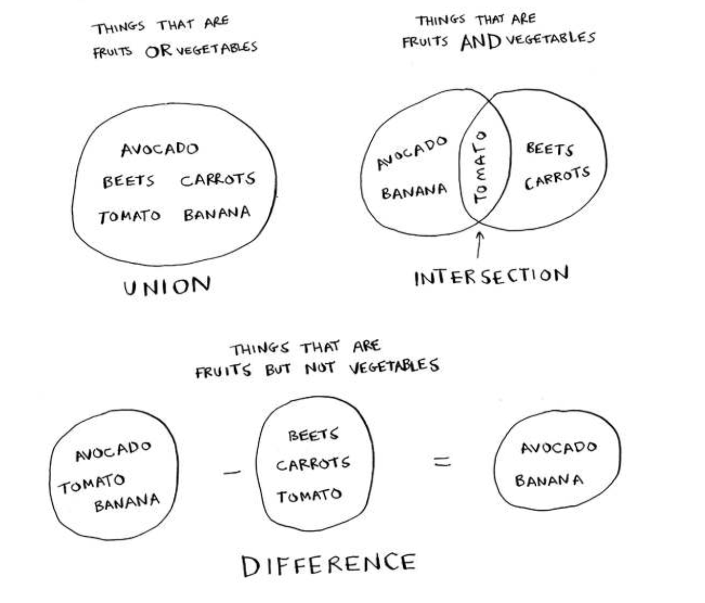
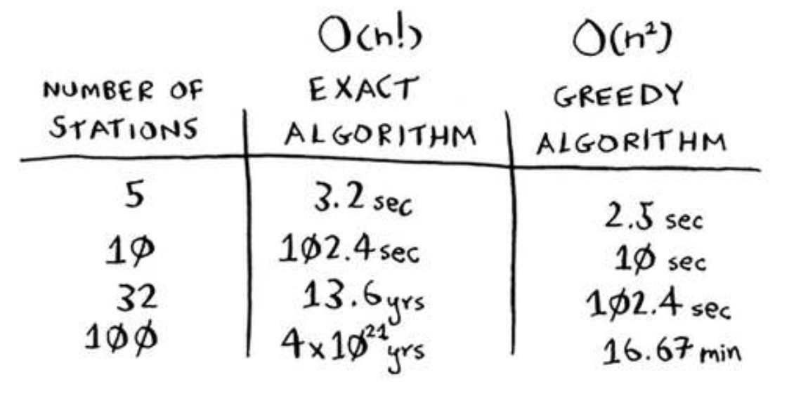

Here are some things you can do with sets.



- A set union means "combine both sets."
- A set intersection means "ind the items that show up in both sets" (in this case, just the tomato).
- A set diference means "subtract the items in one set from the items in the other set."

```python
fruits = set(["avocado", "tomato", "banana"])
vegetables = set(["beets", "carrots", "tomato"]) 

fruits | vegetables # Union: set(["avocado", "beets", "carrots", "tomato", "banana"])
fruits & vegetables # Intersection: set(["tomato"])

fruits – vegetables # Difference: set(["avocado", "banana"]) 
vegetables – fruits # Difference: set(["beets", "carrots"]) 
```




How many possible routes are there for six cities? If you guessed 720, you’re right. 5,040 for 7 cities, 40,320 for 8 cities.
This is called the factorial function (remember reading about this in chapter 3?). So 5! = 120. Suppose you have 10 cities. How many possible routes are there? 10! = 3,628,800. You have to calculate over 3 million possible routes for 10 cities. As you can see, the number of possible routes becomes big very fast! This is why it’s impossible to compute the “correct” solution for the traveling-salesperson problem if you have a large number of cities.
The traveling-salesperson problem and the set-covering problem both have something in common: you calculate every possible solution and pick the smallest/shortest one. Both of these problems are NP-complete.


## Approximating
What’s a good approximation algorithm for the traveling salesperson? Something simple that inds a short path. See if you can come up with an answer before reading on.
Here’s how I would do it: arbitrarily pick a start city. hen, each time the salesperson has to pick the next city to visit, they pick the closest unvisited city. Suppose they start in Marin.
Total distance: 71 miles. Maybe it’s not the shortest path, but it’s still pretty short.

## Is problem NP-complete
The short answer: there’s no easy way to tell if the problem you’re working on is NP-complete. Here are some giveaways:
- Your algorithm runs quickly with a handful of items but really slows down with more items.
- “All combinations of X” usually point to an NP-complete problem.
- Do you have to calculate “every possible version” of X because you can’t break it down into smaller sub-problems? Might be NP-complete.
- If your problem involves a sequence (such as a sequence of cities, like traveling salesperson), and it’s hard to solve, it might be NP-complete.
- If your problem involves a set (like a set of radio stations) and it’s hard to solve, it might be NP-complete.
- Can you restate your problem as the set-covering problem or the traveling-salesperson problem? hen your problem is deinitely NP-complete.

## Recap
- Greedy algorithms optimize locally, hoping to end up with a global optimum.
- NP-complete problems have no known fast solution.
- If you have an NP-complete problem, your best bet is to use an approximation algorithm.
- Greedy algorithms are easy to write and fast to run, so they make good approximation algorithms.