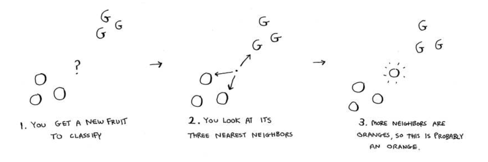
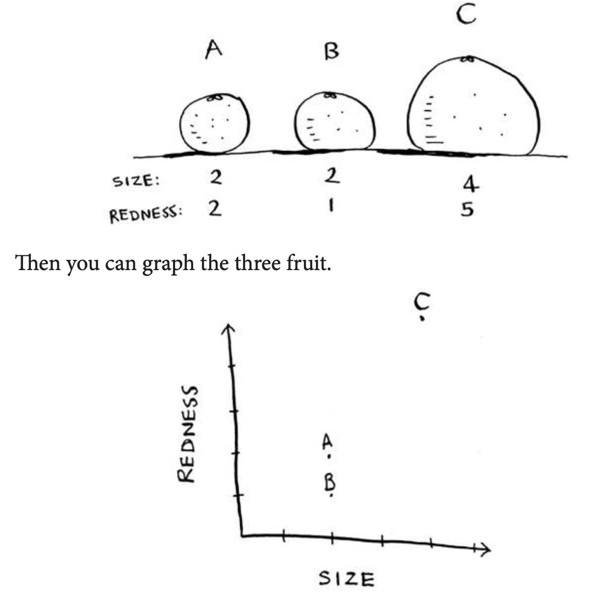
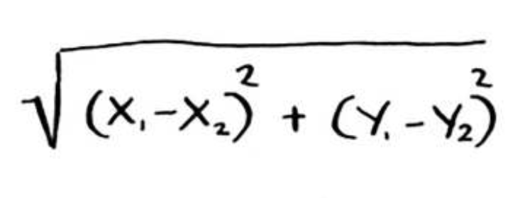
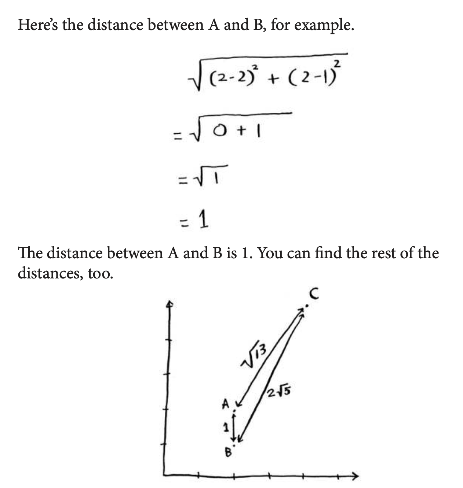
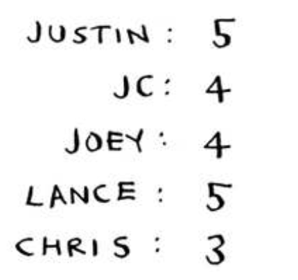

# K-nearest neighbors (KNN)

k-nearest neighbors (KNN) steps:

In the grapefruit example, you compared fruit based on how
big they are and how red they are. Size and color are the features you’re comparing. Now suppose you have three fruit. You can extract the features.

From the graph, you can tell visually that fruits A and B are similar. Let’s measure how close they are. To ind the distance between two points, you use the Pythagorean formula.

Suppose you’re trying to guess a rating for Pitch Perfect. Well, how did Justin, JC, Joey, Lance, and Chris rate it?

You could take the average of their ratings and get 4.2 stars. hat’s called regression. hese are the two basic things you’ll do with KNN—classiication and regression:
- Classiication = categorization into a group
- Regression = predicting a response (like a number)

## Recap
I hope this gives you an idea of all the diferent things you can do with KNN and with machine learning! Machine learning is an interesting ield that you can go pretty deep into if you decide to:
- KNN is used for classiication and regression and involves looking at the k-nearest neighbors.
- Classiication = categorization into a group.
- Regression = predicting a response (like a number).
- Feature extraction means converting an item (like a fruit or a user)
into a list of numbers that can be compared.
- Picking good features is an important part of a successful KNN algorithm.