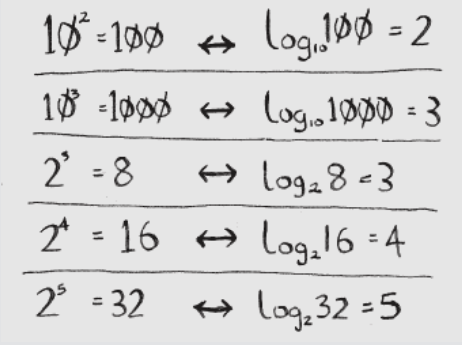

## Logarithms
log10 100 is like asking, “How many 10s do we multiply together to get 100?” he answer is 2: 10 × 10. So log10 100 = 2. Logs are the lip of exponentials.

### Logs are the flip of exponentials.
In this book, when I talk about running time in Big O notation (explained a little later), log always means log2. When you search for an element using simple search, in the worst case you might have to look at every single element. So for a list of 8 numbers, you’d have to check 8 numbers at most. For binary search, you have to check log n elements in the worst case. For a list of 8 elements, log 8 == 3, because 23 == 8. So for a list of 8 numbers, you would have to check 3 numbers at most. For a list of 1,024 elements, log 1,024 = 10, because 210 == 1,024. So for a list of 1,024 numbers, you’d have to check 10 numbers at most.